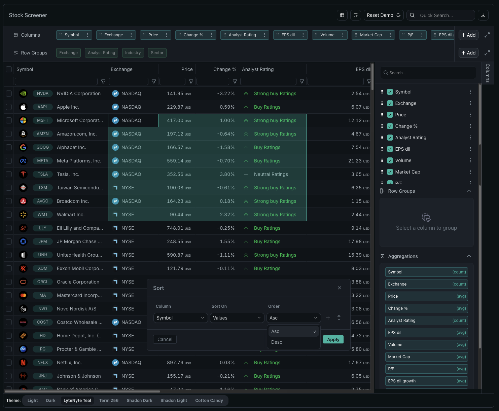

# LyteNyte Grid Stock Screener Demo

This demo shows how to build a stock screener using LyteNyte Grid.
It’s a fork of the code used to create the Stock Screener demo
on the [1771 Technologies website](https://www.1771technologies.com/demo).

The demo highlights the flexibility of LyteNyte Grid and some of its key capabilities. As
a quick overview, the demo shows:

- Sorting rows. This can be performed by clicking on the arrow icons in the header of a column,
  or via the [Sort Manager](https://www.1771technologies.com/docs/component-sort-manager) dialog.
  It is also possible to add multiple sorts at the same time.
- Filtering functionality. The demo manages filtering through a floating row positioned below the header
  row. Quick filter expressions are supported, and users may additionally expand a filter configuration popover
  for given columns. The filter popover displays the usage of
  the [Filter Tree](https://www.1771technologies.com/docs/component-filter-tree) functionality available in LyteNyte Grid.
- Quick searching via a text input. The demo demonstrates LyteNyte Grid's [Quick Search](https://www.1771technologies.com/docs/filter-quick-filter)
  functionality and how it allows users to effortlessly find the data they are looking for.
- Row grouping and aggregations are enabled through the grid's [Pill Manager](https://www.1771technologies.com/docs/component-grid-box) support or via
  the provided [Column Manager](https://www.1771technologies.com/docs/component-column-manager) components. The demo further illustrates the flexibility
  in design by placing the Column Manager in a side panel and in a dialog.
- Columns may be [resized and moved](https://www.1771technologies.com/docs/column-moving). Furthermore, the [autosizing](https://www.1771technologies.com/docs/column-autosizing)
  functionality for all the columns has been provided.

In addition to the above functionality, many other features are illustrated, such as custom cell
renders, copy and paste functionality, cell range selection, row selection, and context menus.
This list isn’t exhaustive. Explore the code to inspire your
own implementations and use cases.

The stock screener demo does not cover all the features that LyteNyte Grid is capable of. Some other
widely used functionality that is missing but may be of interest includes:

- [Column Pivoting](https://www.1771technologies.com/docs/column-pivoting)
- [Server Data Loading](https://www.1771technologies.com/docs/server-data-loading-overview)
- [Tree Data](https://www.1771technologies.com/docs/row-tree-data-source)
- [Full Width Rows](https://www.1771technologies.com/docs/row-full-width)
- [Cell Editing](https://www.1771technologies.com/docs/cell-editing)
- [Row Dragging](https://www.1771technologies.com/docs/row-dragging)

Visit our [website](https://www.1771technologies.com/) for more information about LyteNyte Grid.

## Setup

The project uses [Vite](https://vite.dev/) for bundling and development. Vite isn’t required but is
our preferred choice. LyteNyte Grid works with Next.js, React Router,
TanStack Start, or any ESM-compatible framework.

To get started, clone the repository:

```sh
git clone https://github.com/1771-Technologies/stock-screen-demo.git
```

Install dependencies and start the dev server:

```sh
pnpm i
pnpm run dev
```

This starts a development server using the standard Vite toolchain.
The dev build runs React in development mode, which is slower than a
production build. To see optimal performance, create a production build:

```sh
pnpm run build
pnpm run preview
```

## About the Data

The demo uses a client-side data source with a small subset of real stock
data, located in `src/data.ts`. The dataset is over a year old and
provided for demonstration only. Do not use it for making financial decisions.
